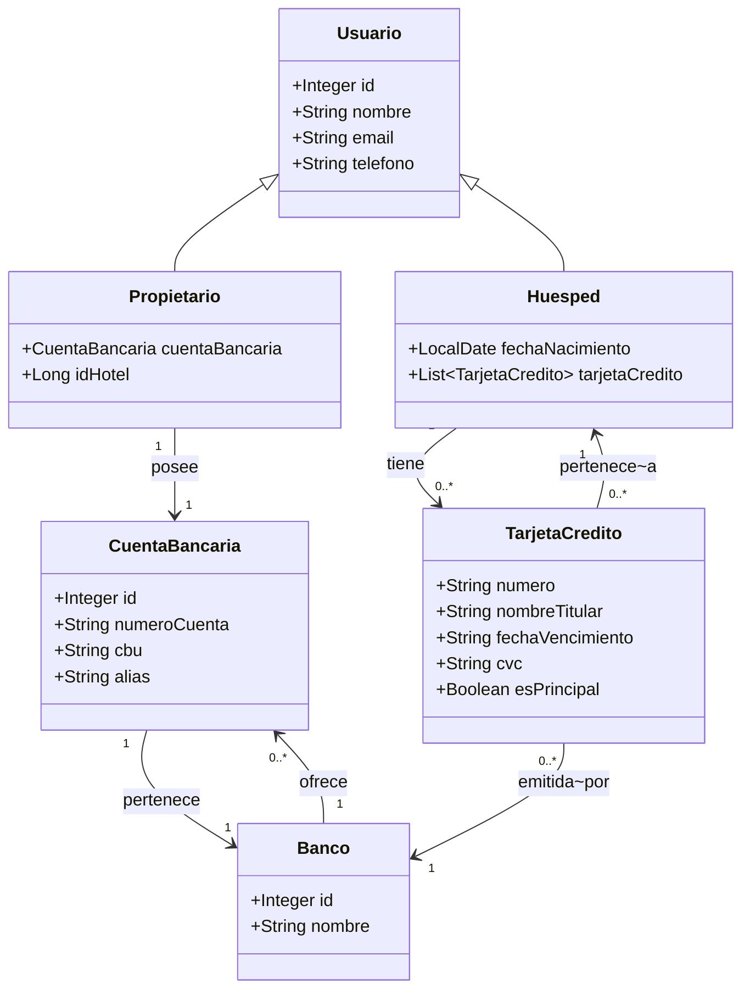

# Trabajo Práctico DAN 2025

Este trabajo práctico consiste en el desarrollo de una aplicación distribuida compuesta por microservicios utilizando Spring Boot para el backend y tecnologías modernas de frontend. El objetivo es aplicar conceptos de arquitectura de software, integración de servicios, despliegue con Docker y buenas prácticas de desarrollo colaborativo en un entorno de trabajo realista.  

El sistema incluye autenticación de usuarios, gestión de datos persistentes con MySQL, comunicación entre servicios, y una interfaz frontend moderna conectada al backend mediante APIs REST. Todo el proyecto está estructurado como un monorepo para facilitar la integración y el despliegue en conjunto.

(Mejorar descripcion)

## Desarrolladores

- Arrua Alejandro   
- Nicle Santiago
- Ramella Sebastian

## Diagrama de datos

---

# WIKI

## Organización de directorios

Este proyecto es un **monorepo**, es decir, todos los elementos necesarios para ejecutar la aplicación están en un único repositorio.

### `/infra`
Contiene los archivos Docker para iniciar los servicios de infraestructura:
- MySQL
- phpMyAdmin

#### Levantar y bajar MySQL y phpMyAdmin

**Levantar ambos servicios**
```bash
docker compose -f infra/docker-compose.yml up -d mysql phpmyadmin
```

**Bajar todos los servicios**
```bash
docker compose -f infra/docker-compose.yml down
```

**Bajar y borrar volúmenes (datos)**
```bash
docker compose -f infra/docker-compose.yml down -v
```

### `/services`
Contiene los microservicios Spring Boot. Por ejemplo:
- user-svc

**Levantar microservicios**
```bash
cd services/user-svc
./mvnw spring-boot:run -DskipTests
```

---

<<<<<<< Updated upstream
## Guías para el desarrollador y el usuario

### Convención de nombre de ticket

**Formato:**

```
[0010]-[T]-[I1] > Ejemplo de nombre de ticket
```
### Convención de nombre de commit

**Formato:**
```
feat(0010): descripción corta
fix(0010): corrección breve
```
Usa feat para funcionalidades nuevas, fix para correcciones.

### Convención de nombre de rama
**Formato:**
```
0010-t-i1-ejemplo-de-nombre-de-ticket
```


## Guía para completar una tarea
**1- Al finalizar la tarea:**

- Registrar el tiempo estimado que llevó realizarla en el campo correspondiente del ticket.
- Crear un Pull Request (PR) desde la rama de trabajo hacia development (link propuesto en consola al realizar un push).
- Asignar la etiqueta testing a la tarea correspondiente.
- Dejar comentario en el ticket con el link al PR.

**2- En el Pull Request:**

- Asegurarse de que la funcionalidad fue testeada manualmente.
- Incluir una descripción breve indicando qué funcionalidades se probaron y cómo.

**3- Revisión y merge:**

- Otro desarrollador debe revisar el código y dejar un comentario confirmando que fue testeado y revisado.
- Luego podrá hacer merge a `development`.

**4. Completar wiki**

- En caso de ser necesario, se completará con instrucciones, guías y aclaraciones relevantes durante el desarrollo del proyecto, con el objetivo de facilitar la colaboración entre los integrantes del equipo y mantener la documentación centralizada y actualizada.
---


## Herramientas necesarias

### IDEs
- [VSCode](https://code.visualstudio.com/)

### Entornos de ejecución backend
- [Java 21](https://adoptium.net/es/temurin/releases/?version=21&package=jdk)
- [Docker Desktop](https://docs.docker.com/desktop/setup/install/windows-install/)

### Entornos de ejecución frontend
- [Node 22](https://nodejs.org/es/download)

### Gestión de código
- [Git](https://git-scm.com/)
- [GitHub](https://github.com/) *(requiere usuario)*

### Gestor de proyecto
- [Quire](https://quire.io/w/Reservas_ARN/33)


### TP Etapa 02
- Tareas necesarias para completar el servicio gestion-svc y reservas-svc [ETAPA02.md](./ETAPA02.md).
- Descripción paso a paso de las acciones a realizar [PRACTICA_02.pdf](PRACTICA_02.pdf)
=======
Documentación detallada (wiki)
- Estructura de carpetas e infraestructura: ver `docs/estructura.md`
- Arquitectura y modelo de datos: ver `docs/arquitectura.md`
- Guías de trabajo, convenciones y herramientas: ver `docs/guias.md`

## Login con Google (beta)

Backend (user-svc):
- Configurar el Client ID de Google como variable de entorno `GOOGLE_CLIENT_ID` (ya referenciado en `docker-compose.yml`).
- Alternativa: editar `services/user-svc/src/main/resources/application.properties` y setear `google.oauth.clientId`.
- Endpoint: `POST http://localhost:8081/auth/google` con cuerpo JSON `{ "credential": "<ID_TOKEN>" }`.

Frontend (Vite):
- Copiar `frontend/.env.example` a `frontend/.env` y completar `VITE_GOOGLE_CLIENT_ID`.
- Se agregó el script de Google Identity Services y un botón en el `Header`.
- Al autenticarse, se guarda el usuario en `localStorage` con clave `user`.

Notas:
- Esta integración verifica el ID Token de Google y crea el usuario (tipo Huesped) si no existe.
- Aún no emite JWT propio ni protege endpoints; eso puede sumarse en una etapa siguiente.
>>>>>>> Stashed changes
